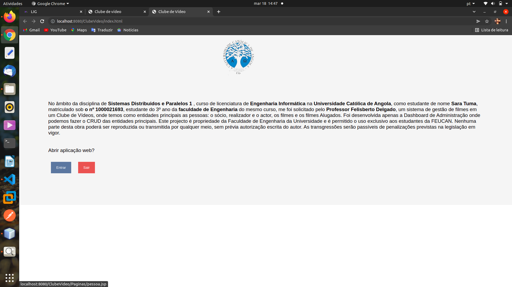
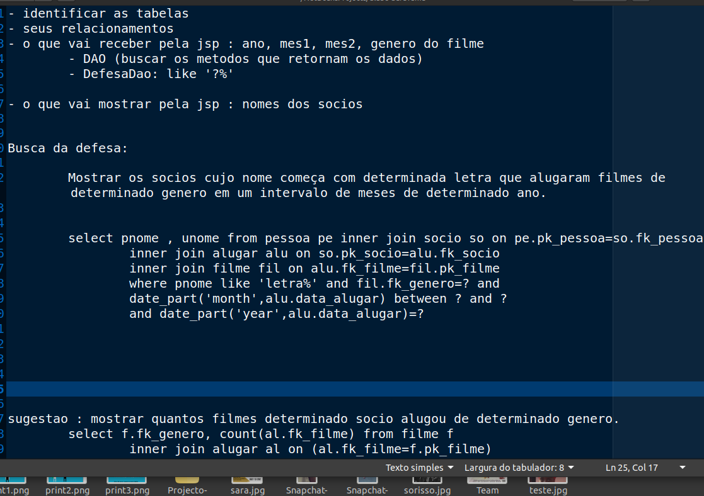

# Projecto-SDP1
Projecto de Sistemas Distribuídos e Paralelos I
Clube de Vídeos - Gestão de filmes, usuarios, filmes alugados.
By Professor Felisberto Delgado

## Situação 6

Imagine que o proprietário de um clube de vídeo o contratou para desenvolver uma base de dados para gerir o seu negócio.
Depois de ter analisado os seus requisitos verificou que este pretendia manter actualizada: 

i. Uma lista de filmes com informação apropriada (titulo português, titulo original ,sinopse, duração, realizador e sua nacionalidade, actores principais e suas nacionalidades, duração, género (comédia, aventura ,etc.), classificação (Maior/6, M/12, M/16, M/18, Adultos) )

ii. A lista de sócios com os seus dados pessoais (nome ,morada, telemóveis, emails, data de nascimento ,número do bilhete de identidade)

iii. Os alugueres efectuados com data de aluguer e devolução

## Ferramentas
1. Java 8, Netbeans 8
2. Server : Apache TomCate
3. Database : PostgreSql
4. SGBD : PgAdmin 4

### Script para a base de dados
Encontra-se no arquivo Script.sql

### Estrutura da App
1. Utilizando a arquitetura MVC   
	1.1. Modelos  
	1.2. Views (jsp)  
	1.3. Controllers  
2. CRUD apenas das entidades principais  
	2.1. Pessoa  
	2.2. Realizador 
	2.3. Actor  
	2.4. Socio  
	2.5. Filme  
	2.6. Aluguer  
	2.7. FilmeActor (relacionamento n:n entre Filmes e Actores)
3. Defesa  
	3.1. Duas jsp (uma para inserir e outra para listar os dados da defesa)  
	3.2. Um controller para fazer a busca sugerida pelo professor.
	

#### PrintScreen da APP

Tela inicial da APP

Quando clicar em Entrar, aparece está tela, com os dados de todas as pessoas cadastradas:

Tela para CADASTRAR uma pessoa na BD

Tela para EDITAR os campos de uma pessoa na BD

Tela para ELIMINAR uma pessoa na base de dados , quando clicar em eliminar!

Quando clicar em Filmes, aparece está tela, com os dados de todos os filmes cadastrados:

Tela para CADASTRAR um filme na BD

Tela para EDITAR os campos de uma pessoa na BD

Tela para ELIMINAR uma pessoa na base de dados , quando clicar em eliminar!

## Para a defesa, temos as telas a seguir

Descrição da defesa, ou seja o que deve ser feito:

A JSP do formulario

A JSP para listar os socios

O controller para fazer a busca na Base de dados

### Resumindo e Conluindo

Foi um grande desafio para mim, principalmente porque tive que aprender como trabalhar com o java na web , conceitos de jsp, servlets, modelos, DAO. Foi muito dificil entender e aplicar esses conceitos, mas felizmente a primeira versão está feita, espero melhorar ainda mais.

Obrigada pela visita, não esquece de deixar aquela estrelinha para mim, agradeceria!

Aproveita e já me segue nas redes sociais. Username: SaraTuma

#### OBRIGADA
